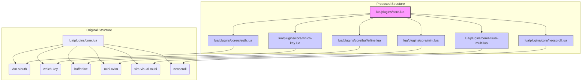

# Refactoring Plan for Neovim Configuration (lua/plugins/core.lua)

## Goal

Improve modularity and maintainability of the Neovim configuration by separating each core plugin's configuration into its own file within the `lua/plugins/core/` directory.

## Current State

`lua/plugins/core.lua` currently defines configurations for multiple plugins directly within the file:

- `tpope/vim-sleuth`
- `folke/which-key.nvim`
- `akinsho/bufferline.nvim`
- `echasnovski/mini.nvim` (multiple modules)
- `mg979/vim-visual-multi`
- `karb94/neoscroll.nvim`

## Proposed State

1.  **Create New Files:** The following new Lua module files will be created in the `lua/plugins/core/` directory:

    - `lua/plugins/core/sleuth.lua`
    - `lua/plugins/core/which-key.lua`
    - `lua/plugins/core/bufferline.lua`
    - `lua/plugins/core/mini.lua`
    - `lua/plugins/core/visual-multi.lua`
    - `lua/plugins/core/neoscroll.lua`

2.  **Move Configurations:** The corresponding Lua table definition for each plugin will be moved from `lua/plugins/core.lua` into its respective new file. Each new file will return the plugin specification table (e.g., `return { ...plugin spec... }`).

3.  **Update `core.lua`:** The `lua/plugins/core.lua` file will be modified to return a table that simply `require`s each of the new modules, similar to how `editor.lua`, `ui.lua`, and `lsp.lua` are structured.

## Visualization

## Next Steps

Proceed with implementation by switching to 'code' mode.
